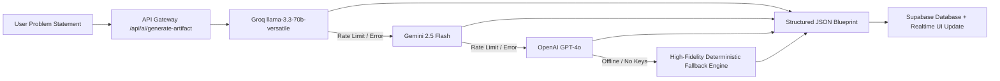

# BizzMitra AI — Complete Agent Master Context & System Blueprint

> **Single-Source System Knowledge & AI Agent Context File**  
> *Provide this file to any AI coding assistant (ChatGPT, Claude, Gemini, Cursor, Copilot, Antigravity) to give it immediate, complete understanding of the BizzMitra AI architecture, modules, routes, tech stack, API keys, database schema, and mobile integration.*

---

## 1. Executive Summary & Core Concept

* **Product Name**: **BizzMitra AI** (*Mitra* = Friend / Trusted Companion in Sanskrit & Hindi).
* **Tagline**: *"From unstructured business problem to implementation-ready enterprise blueprint in one unified, connected workspace."*
* **Core Value Proposition**: Replaces fragmented enterprise consulting tools (Word, Jira, Lucidchart, Visio, Miro, Excel, Postman) by taking an unstructured raw business problem statement and automatically generating an end-to-end, interconnected 10-layer enterprise transformation blueprint.
* **Interconnected Reactive State**: Changing a field or domain problem (e.g. Solar IoT vs. Healthcare LIS vs. FinTech Lending vs. TalentCraft HR) automatically propagates through all 10 downstream artifacts in real-time.

---

## 2. Full Technology Stack

| Layer | Technologies & Libraries |
|---|---|
| **Core Web App** | React 19, TypeScript, Vite 8, TanStack Start, Nitro serverless engine |
| **Routing & Navigation** | `@tanstack/react-router` (File-based routing with `createFileRoute`), TanStack Router Code-Splitter |
| **Styling & Design System** | Tailwind CSS v4, OKLCH Color space, Neu-Bold-Minimal Design System, Lucide React icons, Sonner toast notifications |
| **Typography** | Bricolage Grotesque (Display & Brand), Plus Jakarta Sans (UI Body), JetBrains Mono (Technical / Code) |
| **Animation & Motion** | Framer Motion, GSAP, CSS Keyframes |
| **Visualizations & Diagrams** | Mermaid.js, Cytoscape.js, Cytoscape-fcose, Cytoscape-cose-bilkent, D3.js (d3-hierarchy, d3-shape, d3-sankey), Recharts |
| **Backend & Server** | Nitro Serverless Gateway (`src/server/api-router.ts`), Node.js runtime, Edge compatibility |
| **Database & Auth** | Supabase (PostgreSQL 16, Row Level Security, Realtime, Supabase Auth with Google OAuth & Email/Password) |
| **AI / LLM Providers** | Groq (`llama-3.3-70b-versatile`), Google Gemini (`gemini-2.5-flash`, `gemini-1.5-pro`), OpenAI (`gpt-4o`), with automatic multi-model failover |
| **Native Mobile Shell** | Capacitor 8 (`@capacitor/android`, `@capacitor/ios`, `@capacitor/app`, `@capacitor/haptics`, `@capacitor/status-bar`, `@capacitor/splash-screen`, `@capacitor/filesystem`, `@capacitor/share`) |
| **Payment Gateway** | Razorpay Checkout SDK (INR ₹ INR-compliant plans & top-ups) with server-side validation |
| **Security & Bot Protection** | Cloudflare Turnstile CAPTCHA (`@marsidev/react-turnstile`) |
| **Export Engines** | PDF generation, Microsoft Word (.doc), Excel (.xls), PowerPoint (.ppt), PostgreSQL 16 DDL (.sql), OpenAPI 3.1 JSON, CSV Data Master |

---

## 3. Complete Module Breakdown & Route Architecture

```
src/routes/
├── __root.tsx                           # Root HTML shell & meta configuration
├── index.tsx                            # Enterprise SaaS landing page (Hero, Bento Grid, Live Demo, Pricing, FAQ)
├── login.tsx                            # Authentication portal (Email/Password, Google OAuth, Cloudflare Turnstile)
├── signup.tsx                           # Enterprise registration with quota initialization
├── dashboard.tsx                        # Workspace Hub & Multi-project management
├── about.tsx                            # About BizzMitra AI, vision, mission, and company details
├── settings.tsx                         # Profile, AI Credit Wallet, Razorpay Subscription Plans, Theme, Language & Sign Out
├── admin.tsx                            # Tenant governance, RBAC role emulator, audit logs & system health
├── share.$token.tsx                     # Read-only public stakeholder blueprint view via shareable tokens
└── workspace/
    ├── new.tsx                          # Executive Intake Form & Dual-Mode Diagnostic Setup
    ├── discovery.tsx                    # AI Diagnostic Interview, 5-Why Analysis & Loss-Tree Synthesis
    ├── solution.tsx                     # Solution Studio, Capability Matrix, Before/After Architecture
    ├── solution_.crm.tsx                # Prototype CRM & Workforce Pipeline Simulator
    ├── architecture.tsx                 # 5-Layer Enterprise System Architecture & Component Topology
    ├── process.tsx                      # BPMN 2.0 Swimlane Flowcharts & Execution Logic
    ├── wireframes.tsx                   # Interactive Wireframe Specs & UI/UX Design System
    ├── data.tsx                         # PostgreSQL Relational ERD & OpenAPI 3.1 REST Contracts
    ├── roadmap.tsx                      # Gantt Delivery Phasing, Capex/Opex Model & ROI Projection
    ├── insights.tsx                     # Executive Transformation Dashboard & OKR Impact Metrics
    ├── map.tsx                          # Artifact Dependency Tree & Consistency Integrity Auditor
    ├── collaboration.tsx                # Stakeholder Sign-Off Matrix, Review Cycles & Comments
    └── export.tsx                       # Universal Export Center (7 enterprise formats: PDF, DOC, XLS, PPT, SQL, JSON, CSV)
```

### Module Details:

1. **Intake & Discovery (`/workspace/new`, `/workspace/discovery`)**:
   - Dual-mode input: Quick AI Problem Prompt or Guided 6-field Executive Intake.
   - Interactive diagnostic chat with automated loss-tree generation and stakeholder impact metrics.
2. **Solution Studio & Live CRM (`/workspace/solution`, `/workspace/solution/crm`)**:
   - Compares legacy AS-IS vs target TO-BE architectures.
   - Generates fully interactive domain prototype CRM (e.g. Candidates for HR, Inverters for Solar, Patients for Health, Loans for FinTech).
3. **5-Layer Architecture (`/workspace/architecture`)**:
   - Interactive layered node graph (Experience, Workflow, Compute/API, Data/Integration, Infrastructure).
   - Component topology, latency benchmarks, and cloud service mapping.
4. **BPMN 2.0 Business Process (`/workspace/process`)**:
   - Multi-role swimlane process maps with executable branching, triggers, SLA metrics, and failure recovery lanes.
5. **UX Wireframes & Design System (`/workspace/wireframes`)**:
   - Visual screen concept blueprints (Mobile + Desktop) with component hierarchies, state tables, and interaction specs.
6. **Data Dictionary & OpenAPI Specifications (`/workspace/data`)**:
   - Complete PostgreSQL relational schema with foreign keys, indexes, and constraints.
   - Interactive OpenAPI 3.1 documentation with copyable REST payloads and cURL commands.
7. **Roadmap, Capex/Opex & ROI (`/workspace/roadmap`)**:
   - 4-quarter delivery Gantt schedule with sprint milestones, staffing FTE requirements, and cumulative ROI breakeven graphs.
8. **Transformation Insights (`/workspace/insights`)**:
   - Executive scorecard, cost deflection charts, error reduction metrics, and SLA acceleration stats.
9. **Artifact Map & Consistency Audit (`/workspace/map`)**:
   - Dependency graph connecting all generated deliverables with automated cross-artifact alignment verification.
10. **Governance & Review (`/workspace/collaboration`)**:
    - Multi-stakeholder approval workflow (CTO, Lead Architect, Product Director, Security Lead) with e-signatures.
11. **Universal Export Center (`/workspace/export`)**:
    - One-click bundle generation producing executive board PDF, Word spec, Excel ROI, PowerPoint pitch deck, PostgreSQL DDL, OpenAPI JSON, and Master CSV.
12. **Settings & Token Wallet (`/settings`)**:
    - AI Token Wallet balance, transaction ledger, Razorpay real-time plan upgrade (Starter ₹0, Growth ₹3,999/mo, Enterprise ₹15,999/mo), and account session sign out.

---

## 4. Environment Variables & API Keys Reference

### 🌐 Client-Side Variables (Exposed to Browser via `VITE_` prefix)
| Variable Name | Required | Purpose |
|---|---|---|
| `VITE_SUPABASE_URL` | **Yes** | Supabase Project URL (`https://<project-ref>.supabase.co`) |
| `VITE_SUPABASE_PUBLISHABLE_KEY` | **Yes** | Supabase Anonymous / Public API Key |
| `VITE_RAZORPAY_KEY_ID` | Optional | Public Razorpay Key ID for client checkout popup (`rzp_test_...` or `rzp_live_...`) |
| `VITE_TURNSTILE_SITE_KEY` | Optional | Cloudflare Turnstile public site key for bot verification |

### 🔒 Server-Side Secrets (Hidden in Serverless Functions / Backend)
| Variable Name | Required | Purpose |
|---|---|---|
| `SUPABASE_SERVICE_ROLE_KEY` | **Yes** (Prod) | Superuser key for server-side PostgreSQL bypass & admin provisioning |
| `GROQ_API_KEY` or `GROQ_API_KEYS` | **Yes** | High-speed LLM inference key(s) for artifact generation (comma-separated for multi-key rotation) |
| `GEMINI_API_KEY` or `GEMINI_API_KEYS` | Optional | Google Gemini API key(s) for secondary failover inference |
| `OPENAI_API_KEY` | Optional | OpenAI API key for GPT-4o fallback |
| `RAZORPAY_KEY_SECRET` | Optional (Prod) | Razorpay Secret Key for server-side HMAC-SHA256 signature verification |

---

## 5. Database Schema & Supabase Architecture

BizzMitra uses Supabase PostgreSQL 16 with Row Level Security (RLS) enabled on all tables:

1. **`profiles`**: User identity, full name, avatar URL, active subscription tier (`free`, `growth`, `enterprise`), and timestamps.
2. **`workspaces`**: Problem blueprint container (`id`, `name`, `industry`, `description`, `owner_id`, `maturity_score`, `settings`, `created_at`).
3. **`artifacts`**: Stored enterprise deliverables keyed by `workspace_id` and `type` (`discovery`, `solution`, `architecture`, `process`, `wireframes`, `data`, `roadmap`, `insights`, `map`, `collaboration`, `export`).
4. **`document_chunks`**: RAG embeddings & vector storage for ingested client corporate documents.
5. **`credit_wallets`**: User AI token balance, monthly quotas, and audited transaction ledger.
6. **`share_tokens`**: Time-limited cryptographic tokens for external read-only stakeholder access.

---

## 6. Authentication & Cross-Platform Deep Linking Flow

### Web Architecture:
- User signs in via Supabase Email/Password or Google OAuth.
- Redirection target: `${window.location.origin}/dashboard`.

### Native Mobile App (Android & iOS via Capacitor):
- **App ID**: `com.bizzmitra.ai`
- **Native Scheme**: `com.bizzmitra.ai://`
- **OAuth Flow**:
  1. App triggers `supabase.auth.signInWithOAuth({ provider: 'google', options: { redirectTo: 'com.bizzmitra.ai://dashboard' } })`.
  2. Google authenticates user and redirects to custom scheme `com.bizzmitra.ai://dashboard#access_token=...`.
  3. `@capacitor/app` catches `appUrlOpen` event in [`src/lib/native-bridge.ts`](file:///d:/sem_5/chaos2commit/bizzmitra-ai/src/lib/native-bridge.ts).
  4. App establishes Supabase session and smoothly routes to `/dashboard` inside the native shell.

---

## 7. AI Multi-Model Synthesis Pipeline

The AI engine lives in [`src/server/api-router.ts`](file:///d:/sem_5/chaos2commit/bizzmitra-ai/src/server/api-router.ts) behind a unified gateway:



---

## 8. Essential Developer Commands

```bash
# Install dependencies
npm install

# Run local development server
npm run dev

# Build production bundle (client + serverless nitro)
npm run build

# Preview production build locally
npx vite preview

# Capacitor Android synchronization
npx cap sync android
npx cap open android

# Capacitor iOS synchronization
npx cap sync ios
npx cap open ios
```

---

## 9. Design Rules & UI Standards for Coding Agents

1. **Aesthetics (Neu-Bold-Minimal)**:
   - Base colors: Warm Graphite (`#181614` in dark, `#F5F3EE` in light) with vivid Crimson/Orange primary accent (`#FF5A3C` / `oklch(0.66 0.19 33)`).
   - Soft inset and outset neomorphic shadows via `.neu`, `.neu-inset`, `.neu-sm`, and `.neu-press`.
   - Never use default blue browser buttons or plain unstyled card containers.
2. **File-Based Routing**:
   - Always place new routes in `src/routes/` using `createFileRoute`.
   - Sub-pages under workspace must be named `src/routes/workspace.<module>.tsx`.
3. **Cross-Component Reactivity**:
   - Dispatch and listen for standard BizzMitra custom window events:
     - `bizzmitra:workspace-changed`
     - `bizzmitra:wallet-changed`
     - `bizzmitra:role-changed`
