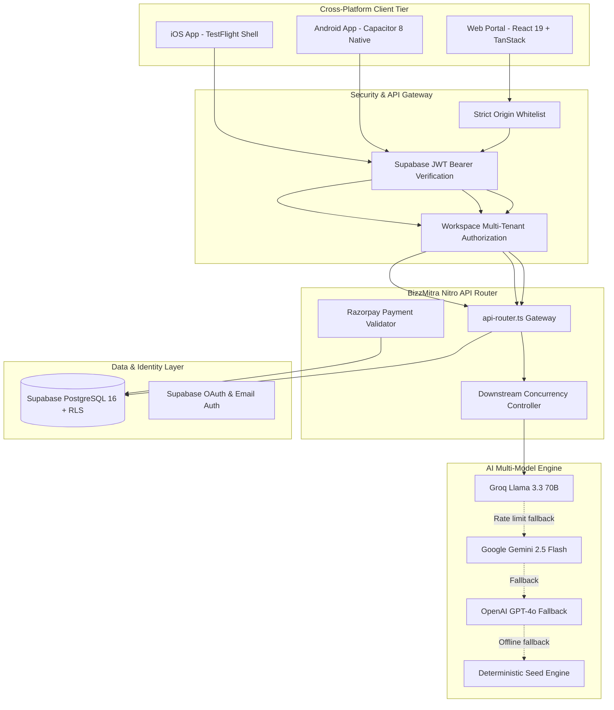

# 🚀 BizzMitra AI — Enterprise Transformation Platform

<div align="center">


[](https://react.dev/)
[](https://www.typescriptlang.org/)
[](https://vitejs.dev/)
[](https://tailwindcss.com/)
[](https://supabase.com/)
[](https://capacitorjs.com/)
[](LICENSE)

**From unstructured business problem to an implementation-ready, 10-layer enterprise transformation blueprint — in one unified, interconnected workspace.**

[Live Web Portal](https://bizzmitra-ai.vercel.app) • [System Architecture](AGENT_CONTEXT.md) • [Mobile Setup](MOBILE_SETUP.md) • [Deployment Guide](DEPLOYMENT.md)

</div>

---

## 📖 Table of Contents

- [Overview & Vision](#-overview--vision)
- [Key Capabilities & Modules](#-key-capabilities--modules)
- [System Architecture](#-system-architecture)
- [Technology Stack](#-technology-stack)
- [Getting Started](#-getting-started)
- [Environment Variables](#-environment-variables)
- [Native Mobile App (Android & iOS)](#-native-mobile-app-android--ios)
- [Security & Multi-Tenant Authorization](#-security--multi-tenant-authorization)
- [Export Formats](#-export-formats)
- [Project Documentation](#-project-documentation)

---

## 💡 Overview & Vision

Traditional enterprise transformation projects suffer from **fragmentation and misalignment**:
* Business analysts capture problems in static Word documents and emails.
* System architects build isolated diagrams in Lucidchart and Visio.
* Database engineers design schemas separately in SQL and ER tools.
* Delivery managers create roadmaps disconnected from real technical dependencies in Jira or Excel.

**BizzMitra AI** (*Mitra* = Trusted Companion in Sanskrit & Hindi) solves this by providing a **unified reactive engine**. When you describe an operational challenge or ingest an SOP document, BizzMitra dynamically synthesizes a complete, interconnected 10-layer architectural blueprint:

```
Raw Business Problem / SOP Ingestion
  │
  ├── 1. Loss-Tree Diagnostic & 5-Why Problem Framing
  ├── 2. Solution Studio & Live Interactive Prototype CRM
  ├── 3. 5-Layer Enterprise Architecture & Component Topology
  ├── 4. Executable BPMN 2.0 Swimlane Flowcharts & Fallback Paths
  ├── 5. UX Screen Blueprints & Design System Specs
  ├── 6. Normalized PostgreSQL 16 Relational ERD & OpenAPI 3.1 Contracts
  ├── 7. 12-Week Phased Roadmap, FTE Staffing & CapEx/OpEx ROI Model
  ├── 8. Executive Transformation Insights & OKR Impact Scorecards
  ├── 9. Artifact Dependency Graph & Cross-Model Integrity Audit
  └── 10. Multi-Stakeholder Governance Matrix & 7 Universal Deliverable Exports
```

---

## ⚡ Key Capabilities & Modules

### 1. 🔍 AI Discovery & Loss-Tree Framing (`/workspace/discovery`)
* Interactive diagnostic interview exploring operational volume, manual drop-offs, and compliance bottlenecks.
* Automated loss-tree synthesis, root-cause decomposition, and quantitative business impact projections.

### 2. 🧩 Solution Studio & Prototype CRM (`/workspace/solution`, `/workspace/solution/crm`)
* Live before/after architecture comparison (Legacy AS-IS vs. Modern TO-BE).
* Dynamic prototype CRM calibrated to your exact domain (e.g. Solar Photovoltaic micro-grids, FinTech loan underwriting, Healthcare LIS specimen tracking, TalentCraft HR recruitment).

### 3. 🏛️ 5-Layer Enterprise System Architecture (`/workspace/architecture`)
* Interactive layered topology (Experience, Workflow, Compute/API, Data/Integration, Infrastructure).
* Real-time node inspection, cloud service mapping, and sub-second latency profiling.

### 4. 🔄 BPMN 2.0 Business Process Engine (`/workspace/process`)
* Executable multi-role swimlanes, trigger matrix, escalation paths, and automated SLA timers.

### 5. 🎨 Interactive UX Designer & Wireframes (`/workspace/wireframes`)
* Mobile + Desktop wireframe screen specifications, state models, and design token hierarchies.

### 6. 🗄️ Relational Data & OpenAPI 3.1 Contracts (`/workspace/data`)
* Production-ready PostgreSQL 16 DDL with Foreign Keys, indexes, and Row Level Security (RLS).
* Interactive OpenAPI 3.1 documentation with copyable payload schemas and cURL commands.

### 7. 📈 Delivery Phasing & CapEx/OpEx ROI (`/workspace/roadmap`)
* 4-quarter delivery Gantt schedule with sprint milestones, staffing resource allocation, and cumulative payback curves.

### 8. 📊 Executive Transformation Insights (`/workspace/insights`)
* Business KPI scorecards, cost deflection analytics, and audit readiness metrics.

### 9. 📦 Universal Export Center (`/workspace/export`)
* One-click generation of 7 enterprise deliverables:
  - 📄 Executive Board PDF Blueprint
  - 📝 Microsoft Word Architecture Spec (`.doc`)
  - 📊 Microsoft Excel Financial ROI Model (`.xls` / `.csv`)
  - 📽️ PowerPoint Executive Pitch Deck (`.ppt`)
  - 🌐 OpenAPI 3.1 JSON Contract
  - 💾 PostgreSQL 16 RLS DDL Script (`.sql`)
  - 📋 Domain Master CSV Data

### 10. 🤖 Blueprint Copilot (`AiCopilotPanel`)
* Persistent, context-grounded AI assistant available across all screens with live model switching (Groq Llama 3.3 70B, Google Gemini, OpenAI GPT-4o) and exact token credit metering.

---

## 🏗️ System Architecture



---

## 🛠️ Technology Stack

| Category | Technologies |
|---|---|
| **Frontend Framework** | React 19, TypeScript 5.8, Vite 8, TanStack Start |
| **Routing** | `@tanstack/react-router` (File-based routing with code-splitting) |
| **Design System** | Tailwind CSS v4, OKLCH color space, Neu-Bold-Minimal System, Lucide Icons |
| **Typography** | Bricolage Grotesque (Display), Plus Jakarta Sans (Body), JetBrains Mono (Code) |
| **Motion & Dynamics** | Framer Motion, GSAP, CSS Micro-animations |
| **Diagrams & Graphs** | Mermaid.js, Cytoscape.js, Cytoscape-fcose, D3.js, Recharts |
| **Backend Gateway** | Nitro Serverless Engine (`src/server/api-router.ts`), Node.js |
| **Database & Auth** | Supabase PostgreSQL 16 with Row Level Security, Supabase Auth |
| **AI Providers** | Groq (`llama-3.3-70b-versatile`), Google Gemini (`gemini-2.5-flash`), OpenAI |
| **Mobile Shell** | Capacitor 8 (`@capacitor/android`, `@capacitor/ios`, `@capacitor/app`, etc.) |
| **Payment Gateway** | Razorpay Checkout SDK (INR ₹ subscription tiers & top-up packages) |
| **Bot Protection** | Cloudflare Turnstile CAPTCHA |

---

## 🚀 Getting Started

### Prerequisites
* Node.js $\ge$ 18.x
* npm or bun
* Supabase account

### Installation

1. **Clone the repository:**
   ```bash
   git clone https://github.com/24CS045Jay/bizzmitra-ai.git
   cd bizzmitra-ai
   ```

2. **Install dependencies:**
   ```bash
   npm install
   ```

3. **Configure environment variables:**
   ```bash
   cp .env.example .env
   ```

4. **Start local development server:**
   ```bash
   npm run dev
   ```
   Open [http://localhost:5173](http://localhost:5173) in your browser.

5. **Build for production:**
   ```bash
   npm run build
   ```

---

## 🔐 Environment Variables

| Variable | Scope | Purpose |
|---|---|---|
| `VITE_SUPABASE_URL` | Public (Client) | Supabase Project URL (`https://<project-ref>.supabase.co`) |
| `VITE_SUPABASE_PUBLISHABLE_KEY` | Public (Client) | Supabase Anonymous Public API Key |
| `VITE_RAZORPAY_KEY_ID` | Public (Client) | Razorpay public Key ID for client checkout popup |
| `VITE_TURNSTILE_SITE_KEY` | Public (Client) | Cloudflare Turnstile public CAPTCHA key |
| `SUPABASE_SERVICE_ROLE_KEY` | Private (Server) | Supabase service role key for admin operations & RLS bypass |
| `VITE_GROQ_API_KEY` / `GROQ_API_KEY` | Server/Client | Groq API key for ultra-fast Llama 3.3 70B inference |
| `VITE_GEMINI_API_KEY` / `GEMINI_API_KEY` | Server/Client | Google Gemini API key for fallback reasoning |
| `RAZORPAY_KEY_SECRET` | Private (Server) | Razorpay Secret Key for HMAC-SHA256 signature verification |

---

## 📱 Native Mobile App (Android & iOS)

BizzMitra AI is wrapped with **Capacitor 8** for high-performance native mobile execution.

### Package Details
* **App ID**: `com.bizzmitra.ai`
* **Custom Scheme / Deep Link**: `com.bizzmitra.ai://`

### Android Development
```bash
# Sync web build to Android project
npx cap sync android

# Open Android Studio to build APK / AAB
npx cap open android
```

### iOS Development
```bash
# Sync web build to iOS project
npx cap sync ios

# Open Xcode
npx cap open ios
```

---

## 🔒 Security & Multi-Tenant Authorization

* **Strict JWT Authentication**: Authenticated routes verify authentic Supabase tokens via `supabaseAdmin.auth.getUser(token)`.
* **Multi-Tenant Ownership**: Built-in `assertWorkspaceOwnership()` middleware validates that users can only read, modify, or trigger AI inference on their own workspaces.
* **CORS Origin Whitelist**: Restricts API calls strictly to approved web and mobile origins (`bizzmitra-ai.vercel.app`, `capacitor://localhost`, etc.).
* **Security Headers**: Production headers include `nosniff`, `SAMEORIGIN`, and strict referrer policies.

---

## 📚 Project Documentation

* 📘 [**AGENT_CONTEXT.md**](AGENT_CONTEXT.md) — Single-source master context & detailed module blueprint for AI coding assistants.
* 🌐 [**DEPLOYMENT.md**](DEPLOYMENT.md) — Vercel serverless deployment and environment configuration.
* 📱 [**MOBILE_SETUP.md**](MOBILE_SETUP.md) — Complete Capacitor mobile setup and signing guide.
* 🎨 [**THEME.md**](THEME.md) — Neu-Bold-Minimal design system, OKLCH colors, and typography rules.

---

## 📄 License

This project is licensed under the MIT License — see the [LICENSE](LICENSE) file for details.
